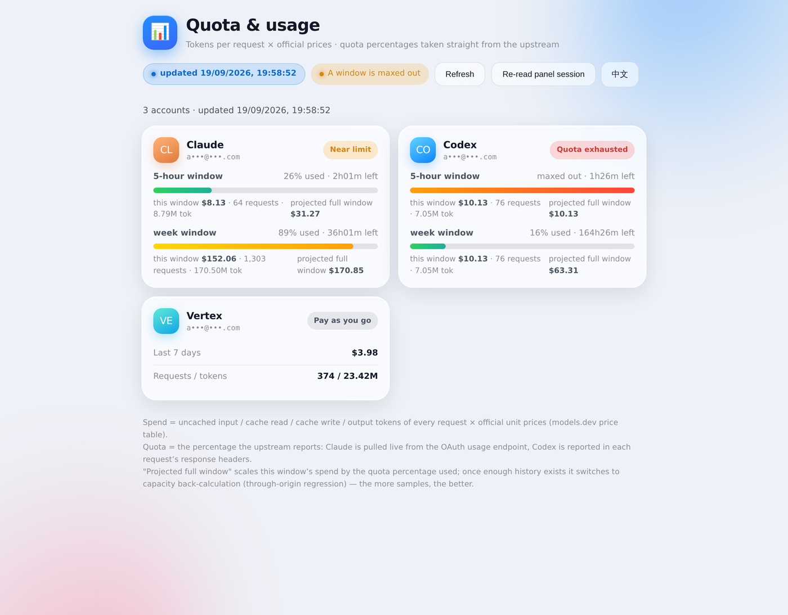
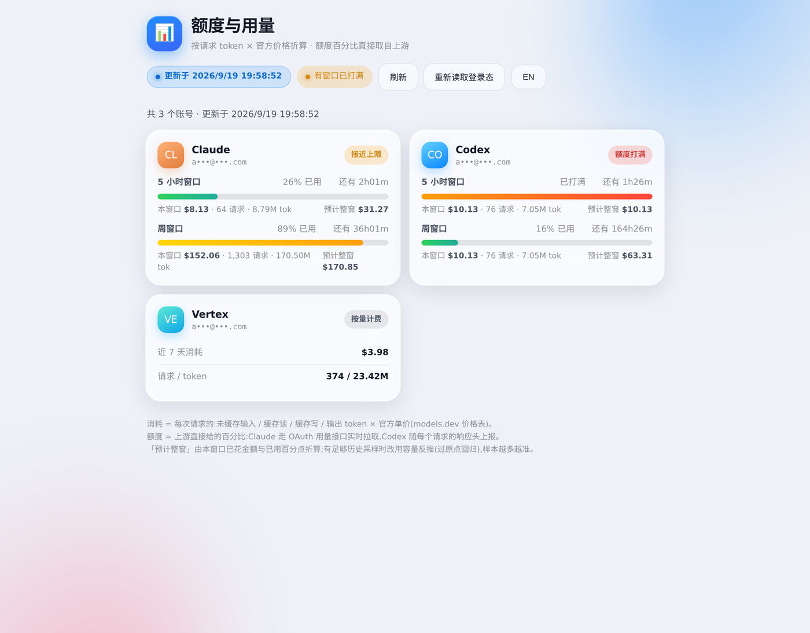
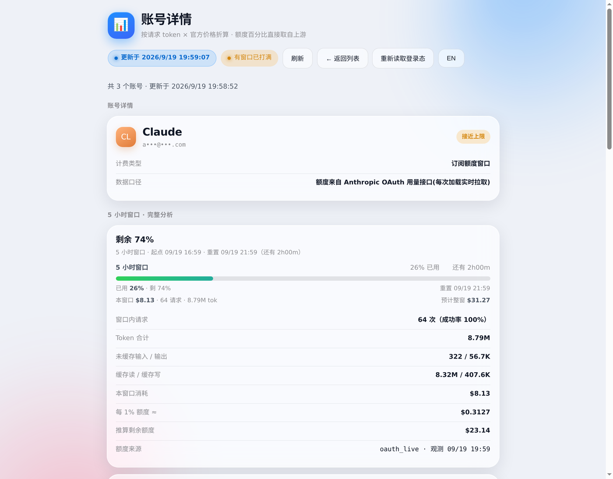

# CPA Quota Cards

[](LICENSE)

A native **CLIProxyAPI** plugin plus a small read-only service that answers exactly two
questions about your proxy accounts:

1. **How much have I used?**
2. **How much quota is left?**

It shows one card per account — 5-hour and weekly quota meters, spend, projected full-window
cost — and a full analysis page per account (including a capacity back-calculation and the
quota prediction the manager panel used to provide). The page is mounted **inside the CPA
Manager Plus sidebar** as 「额度与用量」, reusing the panel login state, so there is no second
credential prompt. The interface is bilingual (English / 简体中文) and follows the panel's own
language setting.

It does **not** reset provider limits, change quotas, or write to anything. The service opens
the manager database read-only (`file:...?mode=ro`) and the price table it uses is the one the
manager already keeps.

## Screenshots

One card per account, with the quota meters, the spend and the projected full-window cost.
Every screenshot in this repository has account identifiers masked.



The page follows the **panel's language**, so switching the panel to 中文 switches the plugin
too — it reads the panel's own language store and reacts live:



Clicking a card opens the full analysis: quota forecast, capacity back-calculation, model mix.



## How it counts

| Concept | Source |
| --- | --- |
| Spend | every request's `normalized_*` token counts × official per-token price (input / output / cache read / cache write) |
| Quota used | the percentage the upstream reports: Claude via the Anthropic OAuth usage endpoint, Codex via response headers |
| Capacity | `total Δspend ÷ total Δpercentage` over a window (a through-origin fit), not a per-segment median |

Two deliberate omissions: there is no "estimated time to exhaustion" and no scheduler/notification.
The plugin shows numbers; it never acts on them.

`normalized_*` matters: for OpenAI-family responses the raw `input_tokens` already contains the
cached part, so pricing raw input double-counts. On the reference deployment that bug alone
inflated a 5-hour window from **$10.13 to $78.76**.

## Architecture

```
                        ┌───────────────────────────────┐
browser ── panel ──────▶│ CPA Manager Plus (panel + API)│
   │  sidebar「额度与用量」└──────────────┬────────────────┘
   │                                    │ /v0/resource/plugins/...
   ▼                                    ▼
Caddy  ── /usage/* ──▶ service :18390   CLIProxyAPI ── plugin cpa-quota-cards.so
                       (read-only)          │  server-side fetch
                       ▲                    │
                       └────────────────────┘  http://<host>:18390/usage/
```

* `service/` — Python 3 stdlib only. `server.py` serves the API and the single-file UI;
  `cpa_usage.py` is the data layer and also usable as a CLI (`python3 cpa_usage.py --json`).
* `plugin/` — Go, built as a `c-shared` library. It registers one resource page and proxies the
  service page into it, so the iframe stays same-origin with the panel. It registers no host
  callbacks and runs no goroutines, so there is nothing to deadlock in the plugin host.
* `deploy/` — systemd unit and a Caddy snippet.

Endpoints: `GET /usage/` (UI), `GET /usage/api/accounts`, `GET /usage/api/accounts/<id>`,
`GET /usage/api/health`. Everything except the health probe requires
`Authorization: Bearer <manager key>`; the key is verified live against the manager API and
never stored by the service.

## Requirements

* CLIProxyAPI with plugin ABI 1 (built and tested against **v7.3.4**), Linux amd64, glibc
* CPA Manager Plus with its SQLite database (tested against **v1.13.1**) — for the usage events,
  the price table and the panel itself
* Python **3.11+**, Docker (for the offline, CPU-pinned plugin build) or just a Go toolchain
* a reverse proxy in front of the panel (Caddy/nginx) to expose `/usage/*` on the panel origin

## Install

### 1. The service

```bash
sudo install -d /opt/cpa-quota-cards
sudo cp -r service /opt/cpa-quota-cards/          # or clone the repo there
sudo install -m 644 deploy/cpa-quota-cards.service /etc/systemd/system/
sudo systemctl daemon-reload && sudo systemctl enable --now cpa-quota-cards
curl -fsS http://127.0.0.1:18390/usage/api/health
```

Put the panel origin in front of it (`deploy/caddy.snippet`):

```
@cpausage path /usage /usage/*
handle @cpausage {
	reverse_proxy 127.0.0.1:18390
}
```

### 2. The plugin

```bash
plugin/scripts/build.sh                    # offline, pinned to 2 CPUs, runs go vet + go test
sudo python3 scripts/install_plugin.py     # copies the .so, writes the config block, verifies
```

`install_plugin.py` takes `--service-url` (default `http://172.29.0.1:18390/usage/`),
`--cache-seconds`, `--timeout-seconds`, `--library`, `--upgrade`, `--status`, `--disable`,
`--dry-run`. It backs the config up first and refuses to continue if anything outside the
plugin's own block would change.

The plugin page then appears in the panel sidebar as **额度与用量** after a panel reload. The
default `service_url` assumes the plugin runs inside a container and the service on the host,
so it points at the docker bridge gateway; set `--service-url http://127.0.0.1:18390/usage/`
when both live on the same host.

### 3. Verify

```bash
scripts/verify_service.py     # drives the standalone page in a real browser
scripts/verify_panel.py       # logs into the panel, clicks the sidebar entry, asserts the cards
scripts/verify_i18n.py        # flips the panel language and asserts the page follows it
scripts/make_readme_shots.py  # regenerates docs/*.png, masking account identifiers
```

Both print a JSON report and a PASS/FAIL line; screenshots land in `shots/`. See
[VERIFICATION.md](VERIFICATION.md) for one real run.

Panel-side scripts must be pointed at the **origin your reverse proxy serves**
(`CPAMP_PANEL_URL=https://<panel-host>/management.html`), not at the manager's own port: the
page's `/usage/api/*` calls only exist on the proxied origin, so against `127.0.0.1:18317`
every account renders as *"Read failed: HTTP 404"*.

## Configuration

Plugin (`plugins.configs.cpa-quota-cards` in `config.yaml`):

| Key | Default | Meaning |
| --- | --- | --- |
| `enabled` | `true` | load the plugin |
| `service_url` | `http://127.0.0.1:18390/usage/` | page to proxy into the sidebar |
| `cache_seconds` | `5` | how long a fetched page is reused |
| `timeout_seconds` | `8` | upstream fetch timeout |

Service (environment):

| Variable | Default | Meaning |
| --- | --- | --- |
| `CPA_USAGE_BIND` / `CPA_USAGE_PORT` | `127.0.0.1` / `18390` | listen address |
| `CPAMP_BASE_URL` | `http://127.0.0.1:18317` | panel/API base, used to verify keys |
| `CPAMP_DB` | `/opt/cpa-manager-plus/data/usage.sqlite` | usage events + price table |
| `CPAMP_ENV_FILE` | `/opt/cpa-manager-plus/.env` | where the manager key is read from |
| `CPA_AUTHS_GLOB` | `/root/CLIProxyAPI/auths/*.json` | credentials, for the Claude usage call |
| `CPA_BASE_URL` | `http://127.0.0.1:8317` | CLIProxyAPI base |
| `CPA_USAGE_STATE` | `<service dir>/state.jsonl` | calibration samples |

Base URLs are normalized (any path is dropped), because a stray `/v1` in the environment is an
easy way to turn every management call into a 404.

## Security notes

* read-only everywhere: the database is opened with `mode=ro`, nothing under the manager or
  CLIProxyAPI is written, no account state is changed;
* the service stores no credentials — an incoming key is verified against the manager API and
  only its hash is cached (10 min), so quota data stays behind the same key as the panel;
* the plugin page itself is a public resource route (like every CPA plugin page). On its own it
  shows nothing, because the data calls need a valid panel key;
* if the plugin runs in a container and calls back to the host service, bind the service to the
  docker bridge and restrict the source range in the firewall rather than exposing it publicly;
* `service/state.jsonl` is deployment data (calibration samples) and is gitignored.

## Pitfalls worth knowing

1. **`config.yaml` is bind-mounted. Never rewrite it atomically.** `os.replace`/`mv` leaves the
   container pinned to the deleted inode — the container keeps running the old config while the
   host sees a new file, and later API writes land in the orphan. `install_plugin.py` rewrites in
   place and warns when it detects the mismatch (`docker restart cli-proxy-api` resyncs).
2. **The management API cannot create a plugin that it has not discovered yet.** `PUT`/`PATCH`
   against an unknown plugin id answer `404` with an empty body. Copy the `.so` first, write the
   config block, then enable.
3. **Only declared resource paths are routed to a plugin.** `/v0/resource/plugins/<id>/<anything>`
   is not a wildcard: register the exact page path you need.
4. **Panel storage is obfuscated, and the format changed.** `enc::v2::` is XORed with a key
   derived from the host only; `enc::v1::` also mixes in the user agent. Both are handled.
5. **Do not reuse generic environment variable names.** A shell that exported
   `CPA_BASE_URL=http://127.0.0.1:8317/v1` silently broke a whole install run.
6. **`pkill -f <pattern>` can kill your own shell** when the pattern appears in the command line.
   Find the pid from the listening port instead.
7. **The page's API only exists on the proxied origin.** `/usage/api/*` is routed by the reverse
   proxy, so the plugin page works in the panel and at `https://<panel-host>/usage/`, but returns
   `404` when the panel is opened directly on its own port. Verify panel-side behaviour through
   the proxy.

## License

MIT — see [LICENSE](LICENSE). Third-party notices in
[THIRD_PARTY_LICENSES.md](THIRD_PARTY_LICENSES.md).

## 中文速览

一个 CLIProxyAPI 原生插件 + 一个只读小服务,回答两个问题:**我用了多少**、**额度还剩多少**。
一个账号一张卡片(5 小时 / 周进度条、本窗金额、整窗预计金额),点进卡片看完整分析(含容量反推
与面板原有的额度预测字段);页面挂在 CPA Manager Plus 左侧栏「额度与用量」,复用面板登录态,
不再二次输入密钥。界面中英双语,默认跟随面板语言;README 里的截图已对账号打码。

口径:消耗 = 每次请求 token × 官方单价(用 `normalized_*` 字段,避免 Codex 缓存 token 重复计费);
额度 = 上游直接给的百分比(Claude 走 OAuth 用量接口,Codex 走响应头);容量 = 整窗「总花费 ÷ 总百分点」
过原点折算。刻意不做「预计耗尽时间」、不做定时推送。
